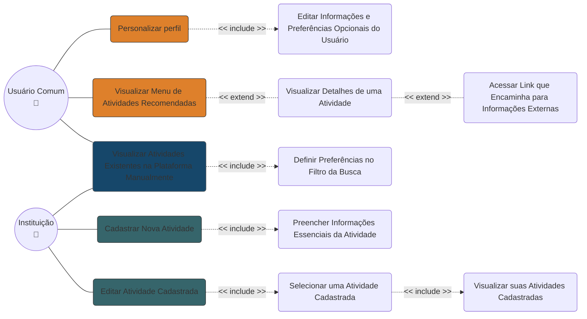

# Casos de Uso

```mermaid

graph LR
    %% Atores
    User((Usuário Comum<br/>👤))
    Inst((Instituição<br/>🏢))

    %% =-=-=-=-=-=-= Casos de Uso =-=-=-=-=-=-=
    UC_PP(Personalizar perfil)
    UC_VMDAR(Visualizar Menu de Atividades Recomendadas)
    UC_VDDUA(Visualizar Detalhes de uma Atividade)
    UC_VAENPM(Visualizar Atividades Existentes na Plataforma Manualmente)
    UC_DPNFDB(Definir Preferências no Filtro da Busca)
    UC_CNA(Cadastrar Nova Atividade)
    UC_EAC(Editar Atividade Cadastrada)
    UC_SUAC(Selecionar uma Atividade Cadastrada)
    UC_VSAC(Visualizar suas Atividades Cadastradas)
    UC_PIEDA(Preencher Informações Essenciais da Atividade)
    UC_EIEPODU(Editar Informações e Preferências Opcionais do Usuário)
    UC_ALQEPIE(Acessar Link que Encaminha para Informações Externas)

    %% =-=-=-=-=-=-= Relacionamentos =-=-=-=-=-=-=
    User --- UC_PP
    User --- UC_VMDAR
    User --- UC_VAENPM

    Inst --- UC_VAENPM
    Inst --- UC_CNA
    Inst --- UC_EAC

    %% Includes
    UC_VAENPM -.->|<< include >>| UC_DPNFDB
    UC_EAC -.->|<< include >>| UC_SUAC
    UC_SUAC -.->|<< include >>| UC_VSAC
    UC_CNA -.->| << include >>| UC_PIEDA
    UC_PP -.->|<< include >>| UC_EIEPODU

    %% Extends
    UC_VMDAR -.-|<< extend >>| UC_VDDUA
    UC_VDDUA -.-|<< extend >>| UC_ALQEPIE

    %% Estilização
    style UC_PP fill:#DE802B,stroke:#333
    style UC_VMDAR fill:#DE802B,stroke:#333
    style UC_CNA fill:#36656B,stroke:#333
    style UC_EAC fill:#36656B,stroke:#333
    style UC_VAENPM fill:#16476A,stroke:#666
```
