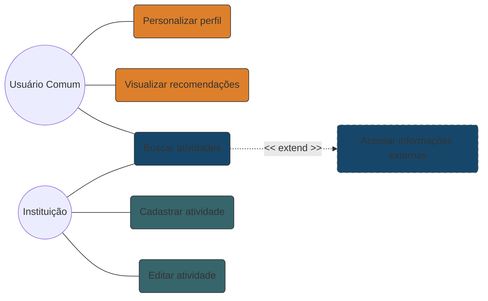

```mermaid
graph LR
    %% Atores
    User((Usuário Comum))
    Inst((Instituição))

    %% Casos de Uso Principais
    UC1(Personalizar perfil)
    UC2(Visualizar recomendações)
    UC3(Buscar atividades)
    UC4(Cadastrar atividade)
    UC5(Editar atividade)
    
    %% Caso de Uso de Dependência: É dependente de Buscar atividades.
    UC6(Acessar informações externas)

    %% Relacionamentos
    User --- UC1
    User --- UC2
    User --- UC3

    Inst --- UC3
    Inst --- UC4
    Inst --- UC5

    %% Dependência
    UC3 -.->|<< extend >>| UC6

    %% Estilização
    style UC1 fill:#DE802B,stroke:#333
    style UC2 fill:#DE802B,stroke:#333
    style UC3 fill:#16476A,stroke:#333
    style UC4 fill:#36656B,stroke:#333
    style UC5 fill:#36656B,stroke:#333
    style UC6 fill:#16476A,stroke:#666,stroke-dasharray: 5 5
```
