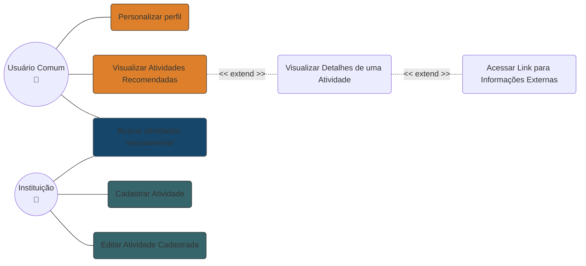

# Casos de Uso

```mermaid

graph LR
    %% Atores
    User((Usuário Comum<br/>👤))
    Inst((Instituição<br/>🏢))

    %% =-=-=-=-=-=-= Casos de Uso =-=-=-=-=-=-=
    UC_PP(Personalizar perfil)
    UC_VAR(Visualizar Atividades Recomendadas)
    UC_VDDUA(Visualizar Detalhes de uma Atividade)
    UC_VAENPM(Buscar atividades 'manualmente')
    UC_CNA(Cadastrar Atividade)
    UC_EAC(Editar Atividade Cadastrada)   
    UC_ALQEPIE(Acessar Link para Informações Externas)

    %% =-=-=-=-=-=-= Relacionamentos =-=-=-=-=-=-=
    User --- UC_PP
    User --- UC_VAR
    User --- UC_VAENPM

    Inst --- UC_VAENPM
    Inst --- UC_CNA
    Inst --- UC_EAC

   
    %% Extends
    UC_VAR -.-|<< extend >>| UC_VDDUA
    UC_VDDUA -.-|<< extend >>| UC_ALQEPIE

    %% Estilização
    style UC_PP fill:#DE802B,stroke:#333
    style UC_VAR fill:#DE802B,stroke:#333
    style UC_CNA fill:#36656B,stroke:#333
    style UC_EAC fill:#36656B,stroke:#333
    style UC_VAENPM fill:#16476A,stroke:#666
```
