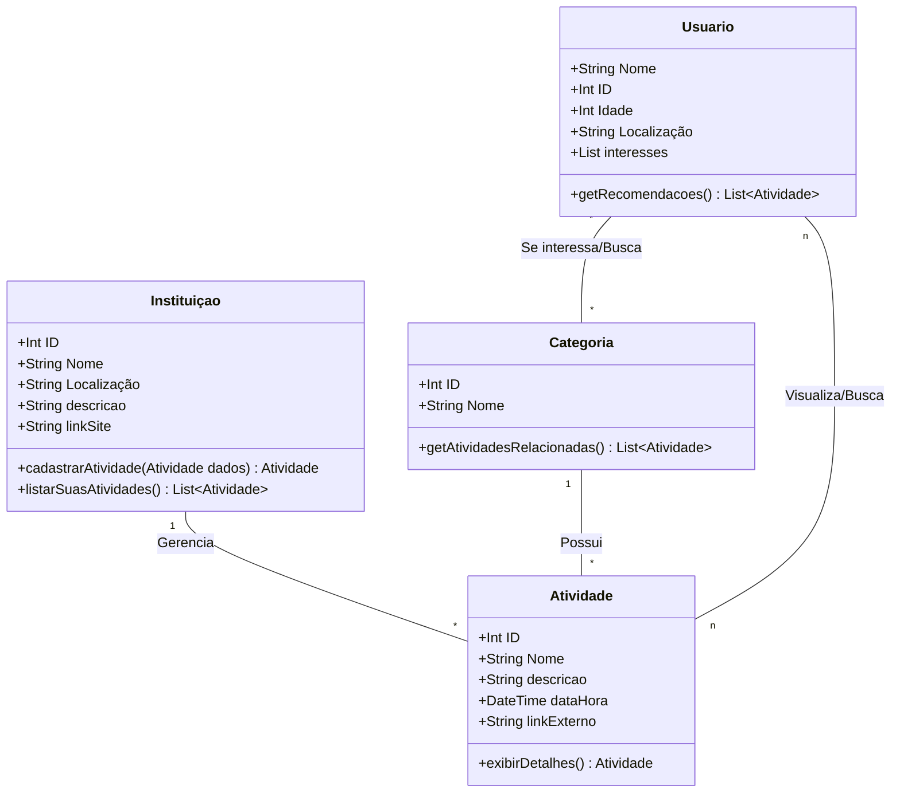

```mermaid

classDiagram
  class Usuario{
      +String Nome
      +Int ID
      +Int Idade
      +String Localização
      +List interesses
      %%----------------------
      +getRecomendacoes() List~Atividade~
  }
  class Instituiçao{
      +Int ID
      +String Nome
      +String Localização
      +String descricao
      +String linkSite
    %%----------------------
      +cadastrarAtividade(Atividade dados) Atividade
      +listarSuasAtividades() List~Atividade~
  }
class Categoria{
      +Int ID
      +String Nome
      %%----------------------
      +getAtividadesRelacionadas() List~Atividade~
  }
class Atividade{
      +Int ID
      +String Nome
      +String descricao
      +DateTime dataHora
      +String linkExterno
      %%----------------------
      +exibirDetalhes() Atividade
  }

Instituiçao "1" -- "*" Atividade : Gerencia
Categoria "1" -- "*" Atividade : Possui
Usuario "*" -- "*" Categoria : Se interessa/Busca
Usuario "n" -- "n" Atividade : Visualiza/Busca

```
