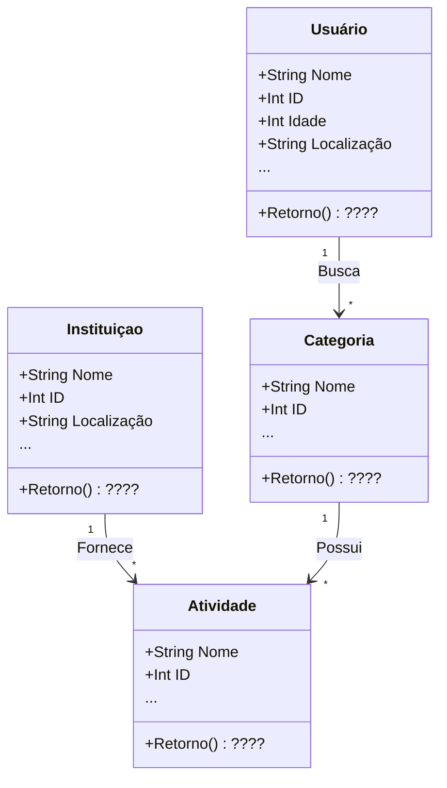

```mermaid

classDiagram
  class Usuário{
      +String Nome
      +Int ID
      +Int Idade
      +String Localização
      ...
      +Retorno()????
  }
  class Instituiçao{
      +String Nome
      +Int ID
      +String Localização
      ...
      +Retorno()????
  }
class Categoria{
      +String Nome
      +Int ID
      ...
      +Retorno()????
  }
class Atividade{
      +String Nome
      +Int ID
      ...
      +Retorno()????
  }

Instituiçao "1" --> "*" Atividade : Fornece
Categoria "1" --> "*" Atividade : Possui
Usuário "1" --> "*" Categoria : Busca

```
