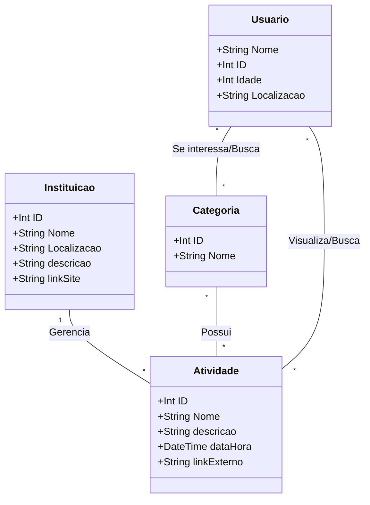

# Diagrama de Classes de Domínio

```mermaid

classDiagram
  class Usuario {
      +String Nome
      +Int ID
      +Int Idade
      +String Localizacao
  }
  class Instituicao {
      +Int ID
      +String Nome
      +String Localizacao
      +String descricao
      +String linkSite
  }
  class Categoria {
      +Int ID
      +String Nome
  }
  class Atividade {
      +Int ID
      +String Nome
      +String descricao
      +DateTime dataHora
      +String linkExterno
  }

  Instituicao "1" -- "*" Atividade : Gerencia
  Categoria "*" -- "*" Atividade : Possui
  Usuario "*" -- "*" Categoria : Se interessa/Busca
  Usuario "*" -- "*" Atividade : Visualiza/Busca

```
