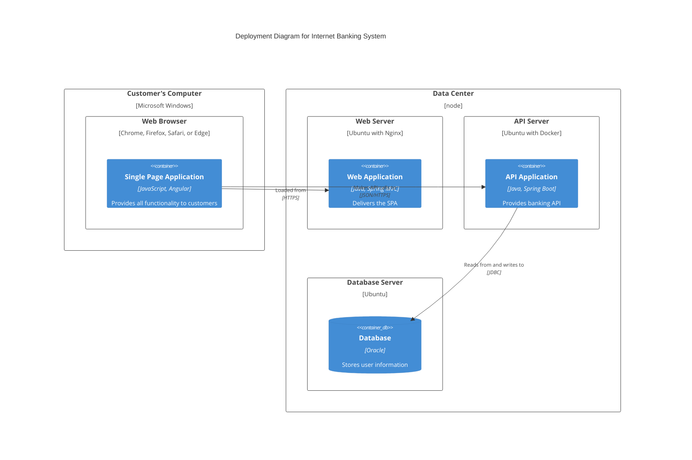

```mermaid
C4Deployment
  title Deployment Diagram for Internet Banking System

  Deployment_Node(customer, "Customer's Computer", "Microsoft Windows") {
      Deployment_Node(browser, "Web Browser", "Chrome, Firefox, Safari, or Edge") {
          Container(spa, "Single Page Application", "JavaScript, Angular", "Provides all functionality to customers")
      }
  }

  Deployment_Node(datacenter, "Data Center") {
      Deployment_Node(web_server, "Web Server", "Ubuntu with Nginx") {
          Container(web_app, "Web Application", "Java, Spring MVC", "Delivers the SPA")
      }
      Deployment_Node(api_server, "API Server", "Ubuntu with Docker") {
          Container(api, "API Application", "Java, Spring Boot", "Provides banking API")
      }
      Deployment_Node(db_server, "Database Server", "Ubuntu") {
          ContainerDb(db, "Database", "Oracle", "Stores user information")
      }
  }

  Rel(spa, web_app, "Loaded from", "HTTPS")
  Rel(spa, api, "Makes API calls to", "JSON/HTTPS")
  Rel(api, db, "Reads from and writes to", "JDBC")

```
