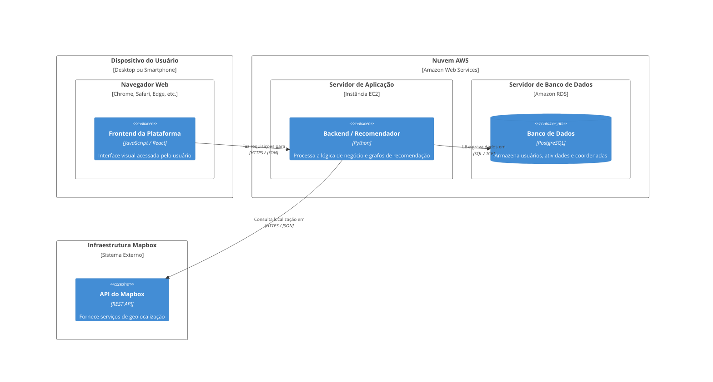

# Diagrama de Implantação

```mermaid
C4Deployment

  Deployment_Node(user_device, "Dispositivo do Usuário", "Desktop ou Smartphone") {
      Deployment_Node(browser, "Navegador Web", "Chrome, Safari, Edge, etc.") {
          Container(frontend, "Frontend da Plataforma", "JavaScript / React", "Interface visual acessada pelo usuário")
      }
  }

  Deployment_Node(aws, "Nuvem AWS", "Amazon Web Services") {
      Deployment_Node(app_server, "Servidor de Aplicação", "Instância EC2") {
          Container(backend, "Backend / Recomendador", "Python", "Processa a lógica de negócio e grafos de recomendação")
      }
      Deployment_Node(db_server, "Servidor de Banco de Dados", "Amazon RDS") {
          ContainerDb(database, "Banco de Dados", "PostgreSQL", "Armazena usuários, atividades e coordenadas")
      }
  }

  Deployment_Node(mapbox, "Infraestrutura Mapbox", "Sistema Externo") {
      Container(mapbox_api, "API do Mapbox", "REST API", "Fornece serviços de geolocalização")
  }

  %% Relacionamentos
  Rel(frontend, backend, "Faz requisições para", "HTTPS / JSON")
  Rel(backend, database, "Lê e grava dados em", "SQL / TCP")
  Rel(backend, mapbox_api, "Consulta localização em", "HTTPS / JSON")

```
