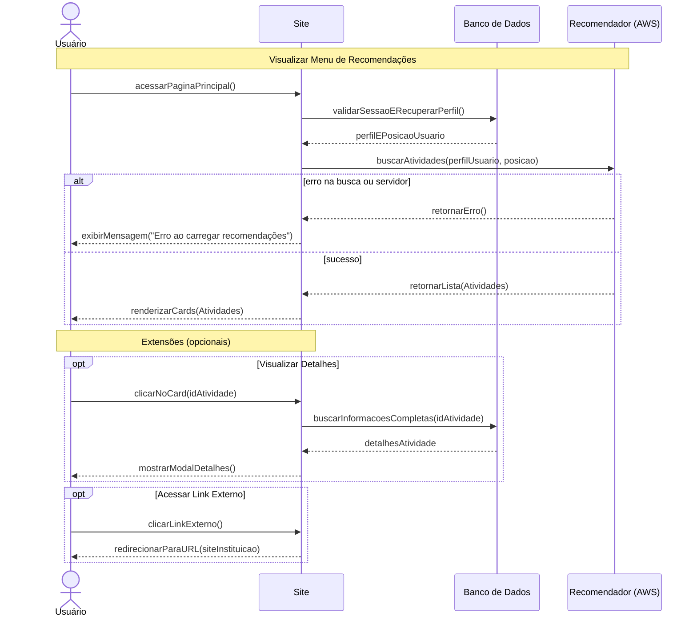

# Diagrama de Sequência

```mermaid

sequenceDiagram
    actor U as Usuário
    participant S as Site
    participant DB as Banco de Dados
    participant R as Recomendador (AWS)

    Note over U, R: Visualizar Menu de Recomendações

    U->>S: acessarPaginaPrincipal()
    S->>DB: validarSessaoERecuperarPerfil()
    DB-->>S: perfilEPosicaoUsuario

    S->>R: buscarAtividades(perfilUsuario, posicao)
    
    alt erro na busca ou servidor
        R-->>S: retornarErro()
        S-->>U: exibirMensagem("Erro ao carregar recomendações")
    else sucesso
        R-->>S: retornarLista(Atividades)
        S-->>U: renderizarCards(Atividades)
    end

    Note over U, S: Extensões (opcionais)

    opt Visualizar Detalhes
        U->>S: clicarNoCard(idAtividade)
        S->>DB: buscarInformacoesCompletas(idAtividade)
        DB-->>S: detalhesAtividade
        S-->>U: mostrarModalDetalhes()
    end

    opt Acessar Link Externo
        U->>S: clicarLinkExterno()
        S-->>U: redirecionarParaURL(siteInstituicao)
    end
```
