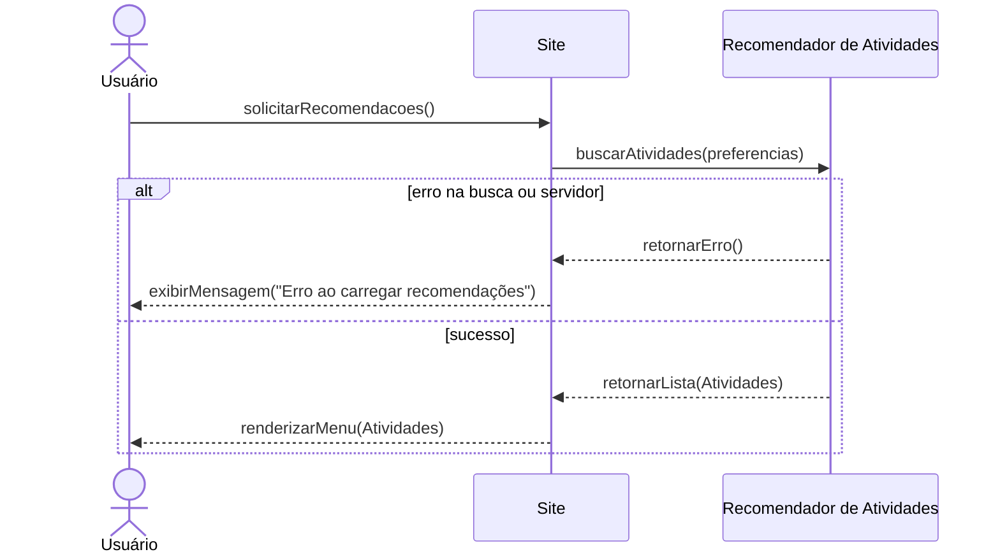

# Diagrama de Sequência

```mermaid

sequenceDiagram
    actor U as Usuário
    participant S as Site
    participant R as Recomendador de Atividades

    %% Ida: Setas contínuas (->>) para requisições
    U->>S: solicitarRecomendacoes()
    S->>R: buscarAtividades(preferencias)

    %% Bloco de Condição: Sucesso vs Falha
    alt erro na busca ou servidor
        R-->>S: retornarErro()
        S-->>U: exibirMensagem("Erro ao carregar recomendações")
    else sucesso
        %% Volta: Setas pontilhadas (-->>) para respostas
        R-->>S: retornarLista(Atividades)
        S-->>U: renderizarMenu(Atividades)
    end
```
