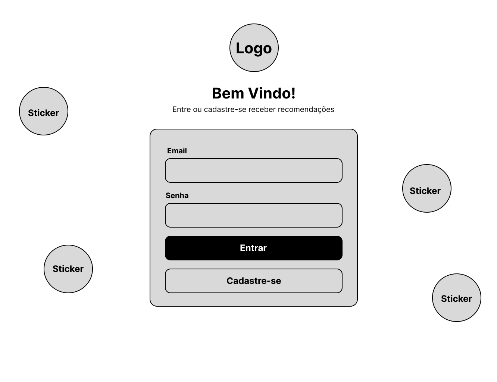
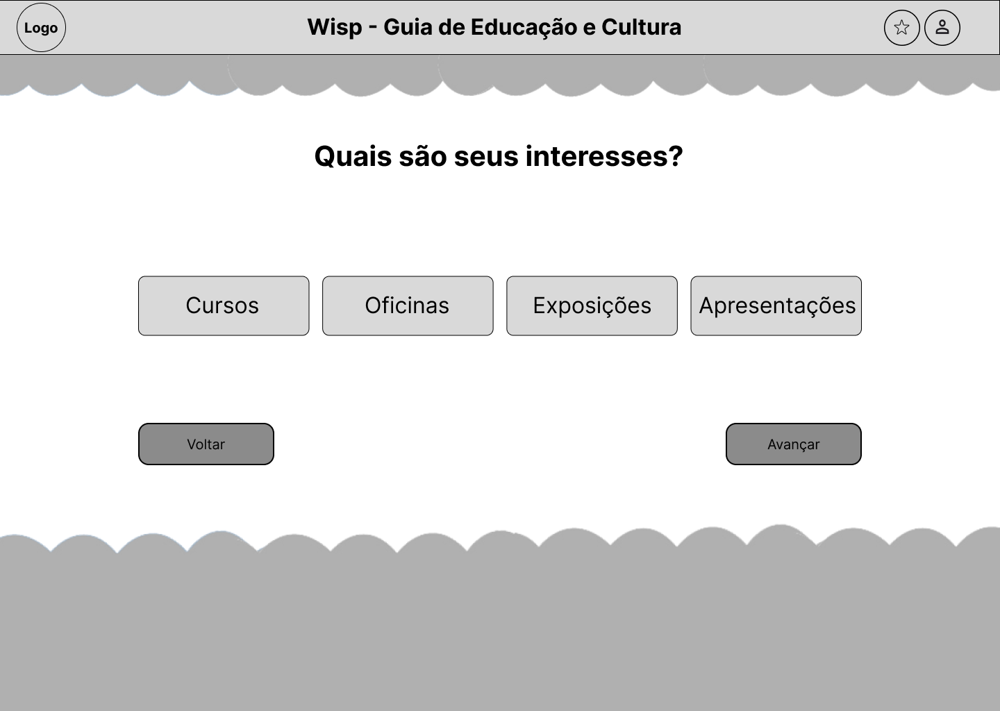
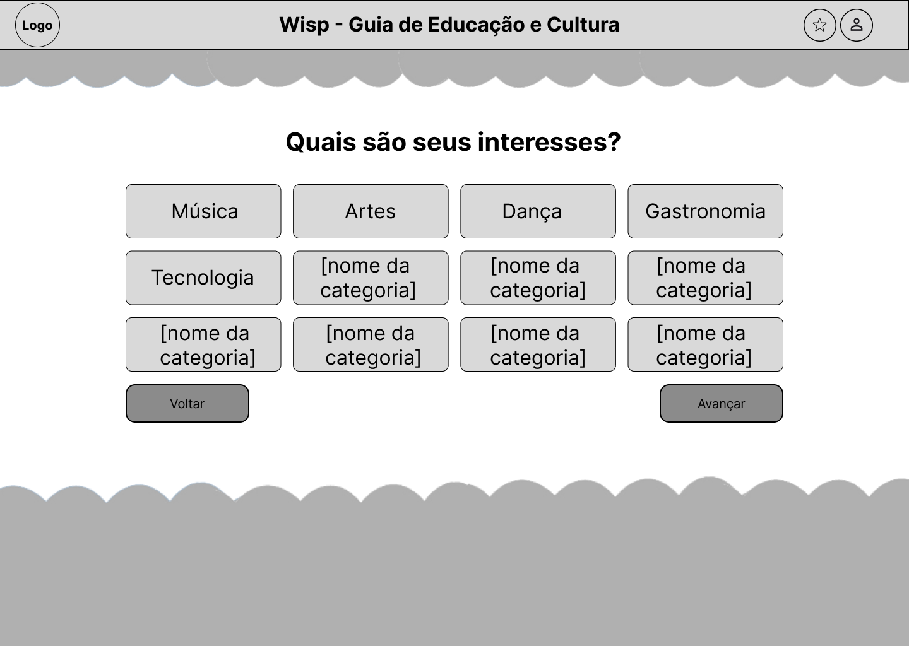
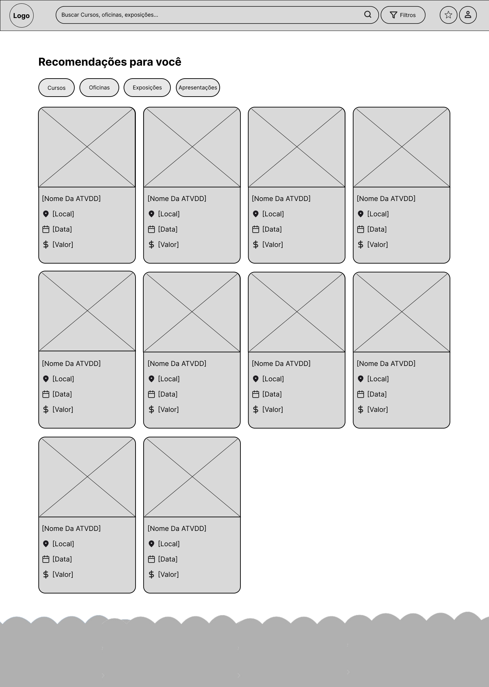
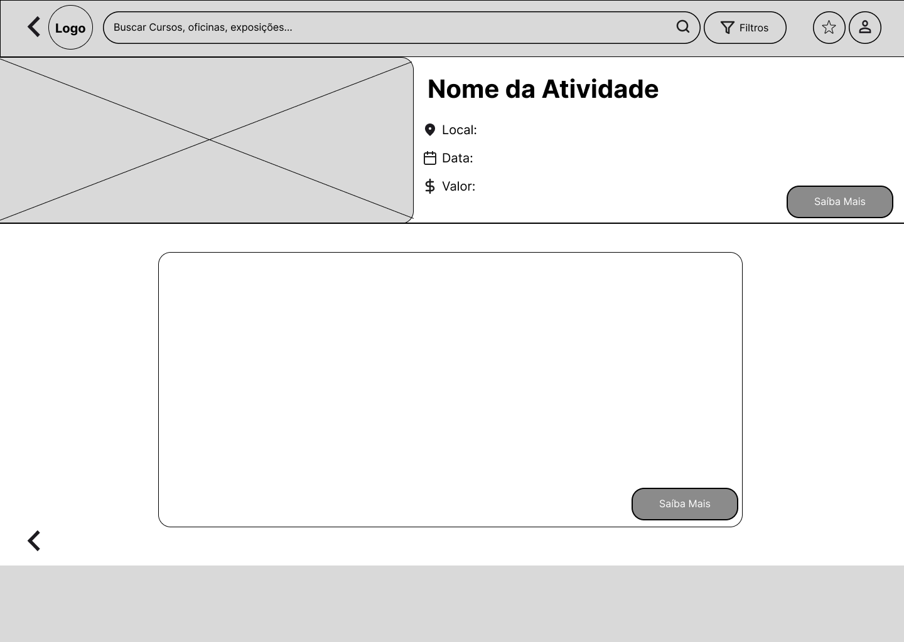
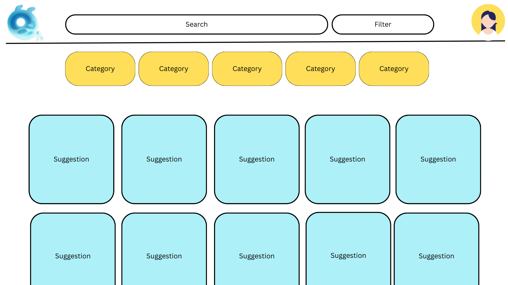

# Wireframes de Baixa Fidelidade

## Página de LogIn

## Quiz de LogIn
### Para personalizar o perfil do usuário:

## Feed
### Página de busca e resultados:

## Detalhes das atividades
### Cada atividade terá sua própria página de atividades:

## Esboço inicial do projeto
### A seguinte imagem foi o nosso primeiro rascunho da ideia:

#### O ícone no canto superior esquerdo foi nossa inspiração para o nome do site e o mascote. É um "seelie" do jogo Genshim Impact produzido pela Hoyoverse